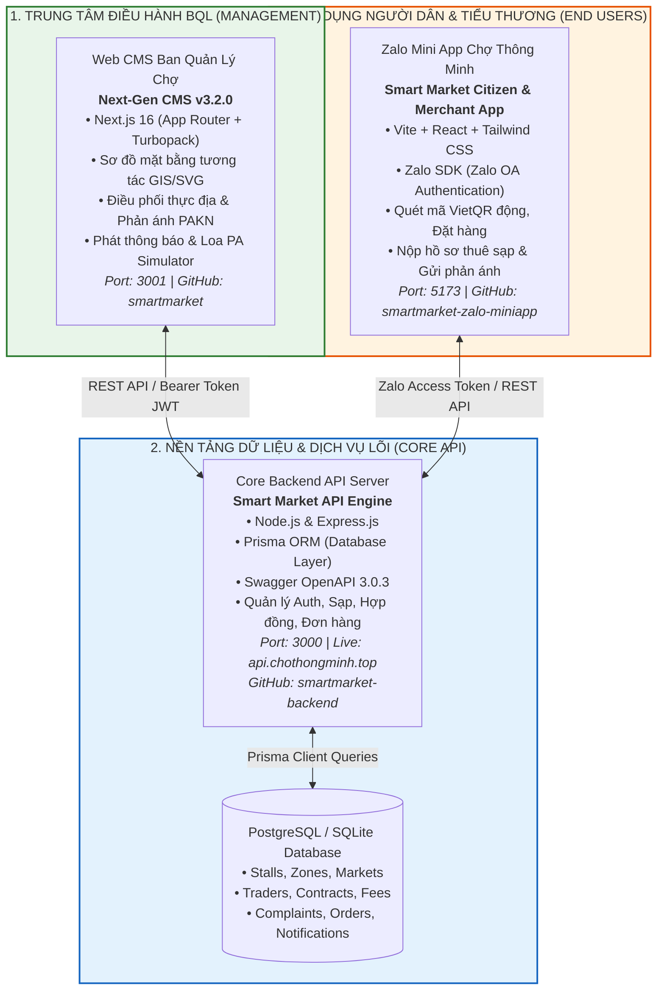
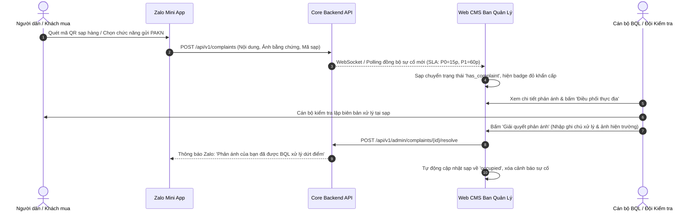
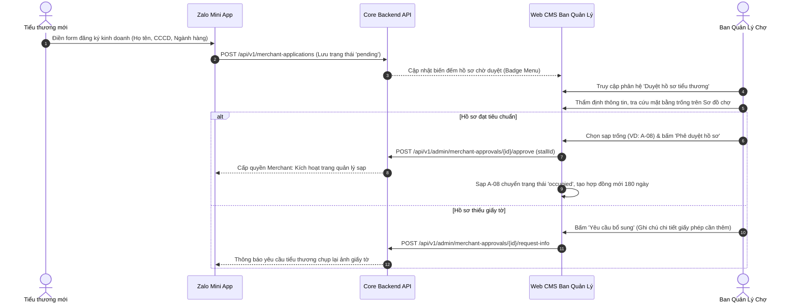
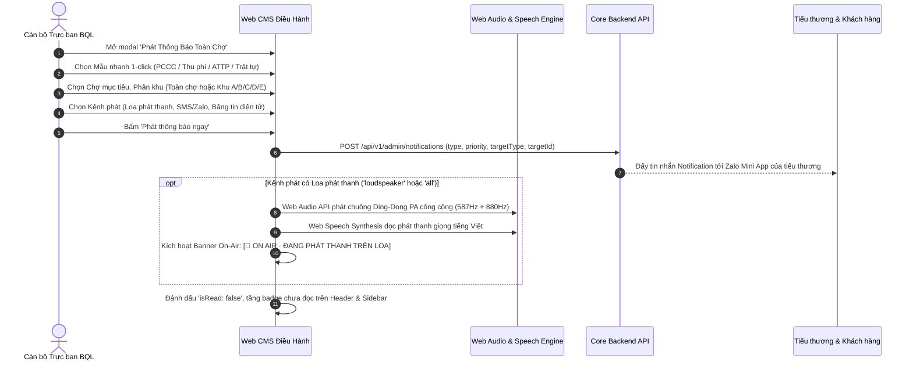
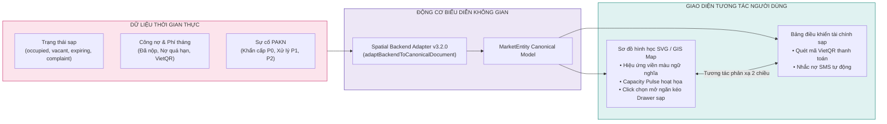

# SƠ ĐỒ HỆ THỐNG & LUỒNG NGHIỆP VỤ HỆ SINH THÁI CHỢ THÔNG MINH (SMART MARKET ECOSYSTEM)

> **Tài liệu bàn giao kiến trúc kỹ thuật (`System Architecture & Business Workflows Specification`)**  
> **Phiên bản:** v3.2.0 Enterprise  
> **Chủ quản:** Ban Quản Lý Chợ Thông Minh & Đội ngũ Kỹ thuật  
> **Cập nhật:** Tháng 09/2026  

---

## 1. TỔNG QUAN KIẾN TRÚC 3 PHÂN HỆ (`TRI-TIER ARCHITECTURE`)

Hệ sinh thái **Chợ Thông Minh (Smart Market)** được tổ chức theo mô hình phân tầng dịch vụ độc lập (`Decoupled Microservices / Multi-Repos`), kết nối 3 chủ thể trung tâm: **Ban Quản Lý Chợ**, **Hộ Tiểu Thương** và **Người Dân / Khách Hàng**.

---

## 2. BẢNG TRA CỨU DỊCH VỤ & KHO LƯU TRỮ (`REPOSITORY MATRIX`)

| STT | Phân hệ (`Service`) | Công nghệ (`Stack`) | Thư mục cục bộ (`Local Directory`) | Cổng (`Port`) | Kho GitHub (`Remote Repository`) |
| :---: | :--- | :--- | :--- | :---: | :--- |
| **1** | **Web CMS Ban Quản Lý** | Next.js 16, React 19, Tailwind CSS, Turbopack | `c:\Users\game\Documents\app\Smartmarket` | `3001` | [`hoadulieu2003-lang/smartmarket`](https://github.com/hoadulieu2003-lang/smartmarket) |
| **2** | **Core Backend API** | Node.js, Express, Prisma ORM, Swagger OpenAPI | `c:\Users\game\Documents\app\Smartmarket - Nguyen\backend-main\backend-main` | `3000` | [`hoadulieu2003-lang/smartmarket-backend`](https://github.com/hoadulieu2003-lang/smartmarket-backend) |
| **3** | **Zalo Mini App** | Vite, React, Tailwind CSS, Zalo SDK | `c:\Users\game\Documents\app\Smartmarket - Nguyen\app-zalo-main (1)\app-zalo-main` | `5173` | [`hoadulieu2003-lang/smartmarket-zalo-miniapp`](https://github.com/hoadulieu2003-lang/smartmarket-zalo-miniapp) |

> [!NOTE]
> Khi cần khởi chạy từng dịch vụ riêng biệt phục vụ môi trường kiểm thử cục bộ (`Local Development`):
> * **Khởi động Web CMS:** Mở terminal tại thư mục `Smartmarket` ➔ chạy `npm run dev -- -p 3001`
> * **Khởi động Core Backend:** Mở terminal tại thư mục `backend-main` ➔ chạy `node mock_api_server.js` (hoặc `npm run dev`)
> * **Khởi động Zalo App:** Mở terminal tại thư mục `app-zalo-main` ➔ chạy `npm run dev -- --port 5173`

---

## 3. SƠ ĐỒ CÁC LUỒNG NGHIỆP VỤ TRỌNG TÂM (`CORE BUSINESS WORKFLOWS`)

### 3.1. Luồng Tiếp Nhận & Xử Lý Phản Ánh Hiện Trường (`Complaints & PAKN Workflow`)

Quy trình giải quyết sự cố, vệ sinh an toàn thực phẩm, gian lận đo lường hoặc an ninh trật tự:

---

### 3.2. Luồng Nộp Hồ Sơ & Phê Duyệt Sạp Tiểu Thương (`Merchant Onboarding Dossier`)

Quy trình số hóa thủ tục đăng ký thuê mặt bằng kinh doanh tại chợ:

---

### 3.3. Luồng Phát Thông Báo Toàn Chợ & Loa Phát Thanh (`Market Broadcast & PA Simulator`)

Quy trình truyền thông đa kênh bảo đảm thông suốt thông tin PCCC, đôn đốc thu phí và an ninh trật tự:

---

### 3.4. Luồng Quản Lý Sơ Đồ Mặt Bằng Không Gian GIS (`Interactive Spatial Floor Plan`)

Quy trình phản xạ dữ liệu 2 chiều giữa sơ đồ bản đồ và số liệu tài chính công nợ:

---

## 4. MA TRẬN API ENDPOINTS KẾT NỐI GIỮA CMS VÀ BACKEND

| Nhóm chức năng (`Module`) | Phương thức (`Method`) | Đường dẫn Endpoint (`API Route`) | Mục đích nghiệp vụ (`Business Purpose`) |
| :--- | :---: | :--- | :--- |
| **Hệ thống chợ** | `GET` | `/admin/markets` | Lấy danh sách toàn bộ các chợ trên địa bàn quản lý |
| **Sạp hàng** | `GET` | `/admin/stalls?limit=100` | Tải dữ liệu toàn bộ sạp, phân khu, trạng thái hợp đồng |
| **Khiếu nại PAKN** | `GET` | `/admin/complaints?limit=100` | Tải danh sách phản ánh của người dân |
| **Giải quyết PAKN** | `POST` | `/admin/complaints/{id}/resolve` | Đóng khiếu nại, lưu ảnh biên bản xử lý hiện trường |
| **Duyệt hồ sơ sạp** | `GET` | `/admin/merchant-approvals?limit=100` | Danh sách đơn đăng ký thuê sạp của tiểu thương |
| **Phê duyệt sạp** | `POST` | `/admin/merchant-approvals/{id}/approve` | Phê duyệt hợp đồng và cấp phát sạp kinh doanh |
| **Từ chối hồ sơ** | `POST` | `/admin/merchant-approvals/{id}/reject` | Từ chối hồ sơ kèm lý do quy chế chợ |
| **Tiểu thương** | `GET` | `/admin/traders?limit=100` | Danh sách danh bạ hộ kinh doanh, đánh giá sao |
| **Hàng hóa sản phẩm** | `GET` | `/admin/products?limit=100` | Danh mục hàng hóa niêm yết giá & nguồn gốc VietGAP |
| **Đơn hàng online** | `GET` | `/admin/orders?limit=100` | Giám sát đơn đặt hàng của khách đi chợ qua Zalo |
| **Phát thông báo** | `POST` | `/admin/notifications` | Phát tin khẩn cấp, đôn đốc nợ phí, phát loa công cộng |

---

## 5. KẾT LUẬN & ĐẶC TẢ BẢO TOÀN KIẾN TRÚC

1. **Tính độc lập & mở rộng (`Extensibility`)**: Tách biệt 3 kho mã nguồn Git riêng biệt trên GitHub bảo đảm mỗi phân hệ phát triển theo chu kỳ độc lập, dễ dàng đóng gói Docker/Container hoặc tích hợp Pipeline CI/CD.
2. **Khả năng chịu lỗi cao (`High Resilience`)**: Web CMS được tích hợp cơ chế dự phòng (`Fallback Mechanism`) trong hook `useBackendSync.ts`. Nếu Core Backend offline hoặc bảo trì, CMS tự động chuyển sang chế độ dữ liệu cục bộ (`Local Fixtures`) mà không làm gián đoạn trải nghiệm của cán bộ BQL.
3. **An toàn dữ liệu tuyệt đối (`Data Integrity`)**: Không lưu trữ mật khẩu, secret key hay token tĩnh trong mã nguồn; tuân thủ nghiêm ngặt chuẩn bảo mật xác thực `Bearer Token` và `Zalo OAuth`.
